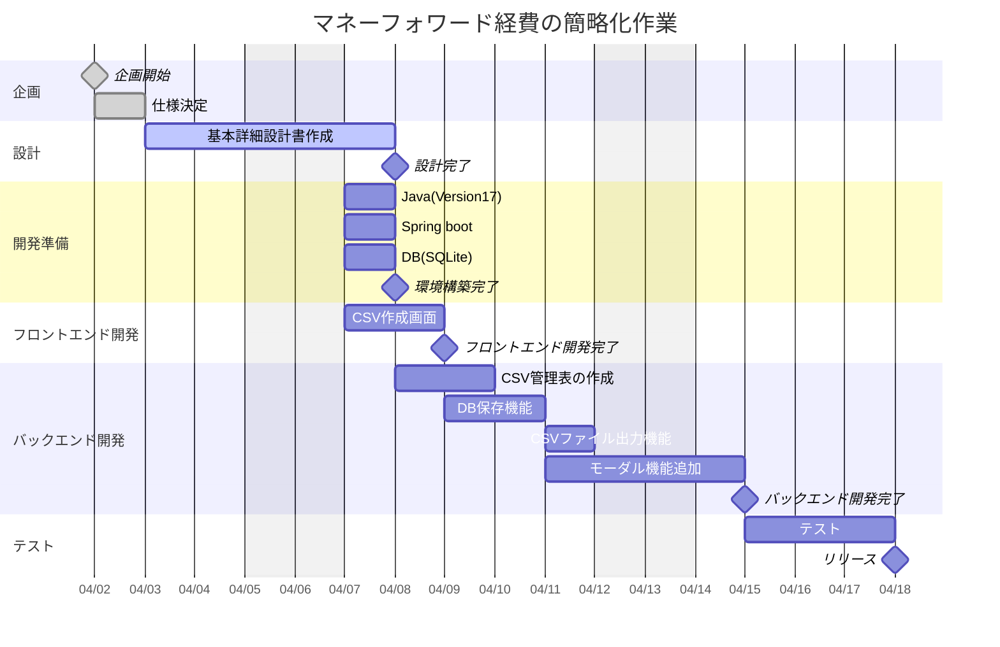

```mermaid
gantt
  title マネーフォワード経費の簡略化作業
  dateFormat  YYYY-MM-DD
  axisFormat  %m/%d  
  excludes    weekends
  tickInterval 1day

  section 企画
    企画開始              : done, milestone, des1, 2025-04-02,
    仕様決定              : done, des1-1, after des1, 1d

  section 設計
    基本詳細設計書作成     : active, des2, after des1-1, 3d
    設計完了              : milestone, 2025-04-08,

  section 開発準備
    Java(Version17)      : des3-1, 2025-04-07, 1d
    Spring boot          : des3-2, 2025-04-07, 1d
    DB(SQLite)           : des3-3, 2025-04-07, 1d
    環境構築完了           : milestone, m3, 2025-04-08,

  section フロントエンド開発
    CSV作成画面           : des4-2, 2025-04-07, 2d
    フロントエンド開発完了  : milestone, after des4-2

  section バックエンド開発
    CSV管理表の作成         : des5-2, 2025-04-08, 1.5d
    DB保存機能             : des5-1, 2025-04-09, 1.5d
    CSVファイル出力機能     : des5-3, after des5-1, 1d
    モーダル機能追加        : des5-4, after des5-1, 2d
    バックエンド開発完了     :milestone,m5, after des5-4,

  section テスト
    テスト               : des6, after m5, 3d
    リリース             : milestone,
```