# 利用手順書

この手順書はVSCodeを用いてツールを実行するための手順書となります。
既に以下の前提環境が整っている場合はapplication.propertiesの修正のみ行ってください。

## 前提環境

| ソフトウェア | バージョン | 備考 |
|-----|--------|-----|
| JDK | 21 | JAVA_HOMEの設定必須 |
| Maven | 3.9.9 | 拡張機能インストール必須 |
| SpringBoot |3.4.5|ー|
| VisualStudioCode |最新版推奨|拡張機能追加必須|
| MySQL |任意のバージョン|ローカルDB構築用|

## セットアップ（開発環境の準備）

### visual studio codeのインストール

1. CSV簡易生成ツールを実行するために以下のサイトをチェックしながらVSCodeのインストールする

- [VSCodeインストール](https://qiita.com/furu38/items/6776acba6621012ee475)

### VSCode拡張機能追加

- [ ] 「Maven for Java」を追加してください

- [ ] 「Spring Boot Extension Pack」を追加してください

- [ ] 「Markdown All in One」を追加してください

- [ ] 「Markdown Preview Mermaid Support」を追加してください

- [ ] 「Markdownlint」を追加してください

### Java（JDK）のインストール

1. コマンドプロンプトで「java -version」を入力し、インストールされていなければ以下の作業を行ってください
2. 公式サイトからJDKをダウンロードする。
3. ダウンロード後にファイルパスの設定をする。

- [JDKインストール～ファイルパスの設定まで](https://simpleonedesign.com/blog/java/install_java/)

### MySQLのインストール

- [ ] 経路情報を管理するためにMySQLのインストールを以下のサイトをチェックしながら行ってください。

- [MySQLのインストール](https://qiita.com/taiyang-ks/items/434495a42ae07f27022c)

- [ ] MySQL8.0 Command Line Clientを起動し自身で設定したPWでログイン
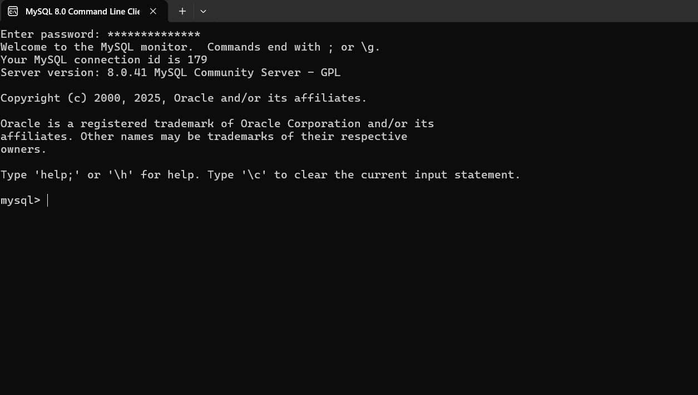

- [ ] 任意のDBを作成
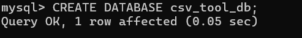

- [ ] 作成されたDBを確認
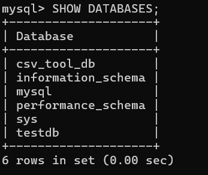

### application.propertiesの修正

1. spring.datasource.url=jdbc:mysql://localhost:3306/testdb?useSSL=false&serverTimezone=UTC

- [ ] ・localhost⇒必要に応じてホスト名やIPの変更が必要
- [ ] ・3306⇒MySQLのポートが異なる場合は修正。
- [ ] ・testdb⇒使用するデータベース名を自分の環境に合わせて修正。

1. spring.datasource.username=root
2. spring.datasource.password=〇〇〇〇〇〇

- [ ] ・root、〇〇〇〇〇〇: ユーザー名・パスワードは自分のMySQLの設定に合わせて変更。

1. server.port=8082

- [ ] ・port⇒ポート番号がかぶる可能性があるため変更する（例：8181など）

## 利用手順

### アプリ起動時の操作

クリーンビルドのためVSCodeのターミナルにて「./mvnw clean install」を実行

VSCodeのターミナルにて「./mvnw spring-boot:run」を入力し実行

### ツール利用前の操作（MF経費側）

①：マネーフォワード経費の申請一覧画面から過去に申請した月の詳細ボタンを押下

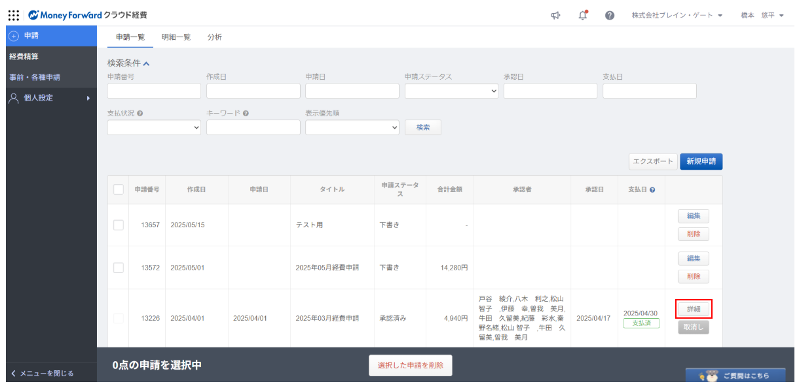

②：明細（ＣＳＶ）ボタンを押下

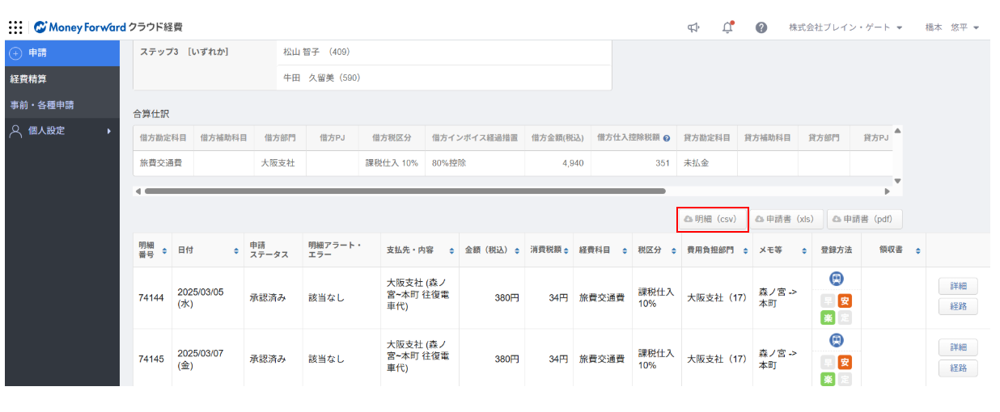

③：ダウンロード履歴を確認しＣＳＶファイルがインポートされていることを確認

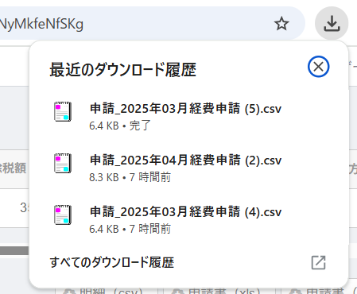

### ツールの使い方

④：画面上部、ＣＳＶファイルの登録画面へをクリック　※すでにＣＳＶファイルを登録済みの場合は不要。

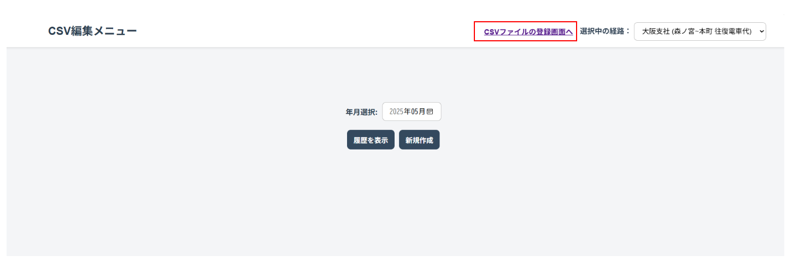

⑤：ファイルの選択をクリック

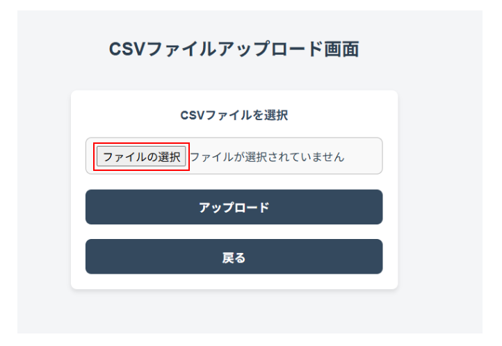

⑥：③で確認したＣＳＶファイルを選択し開くをクリック

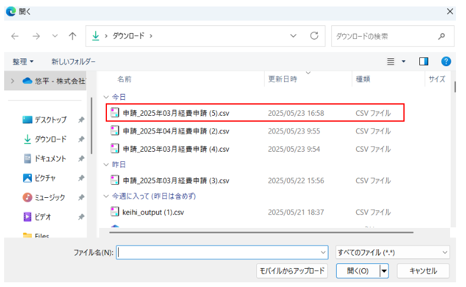

⑦：アップロードボタンを押下

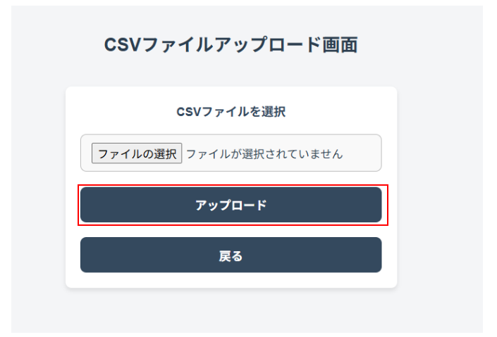

⑧：画面右上の選択経路に経路名が入っており選択年月に当月が入っていることを確認　※経路や年月は選択可能

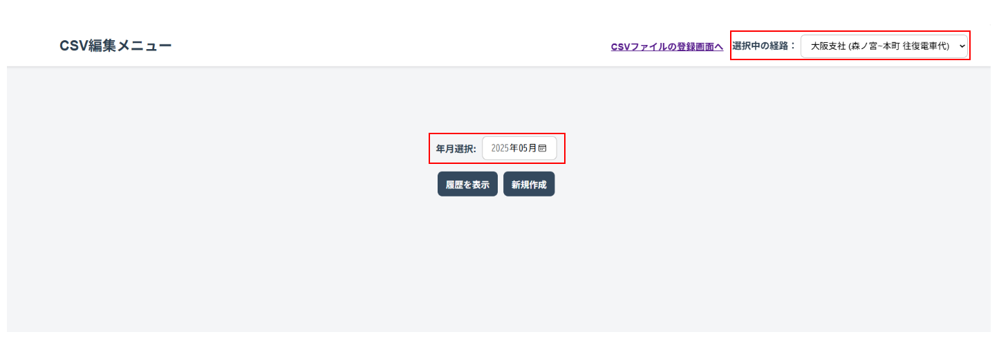

⑨：履歴を表示or新規作成を押下

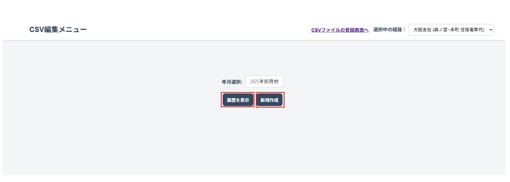

⑩：履歴画面を表示　※土日祝のチェックが外れているか確認

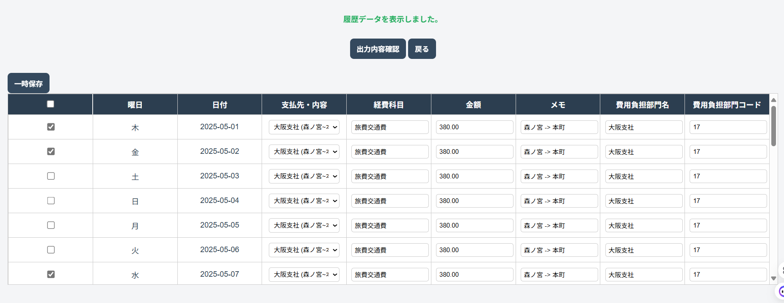

⑪：新規画面を表示　※土日祝のチェックが外れているか確認

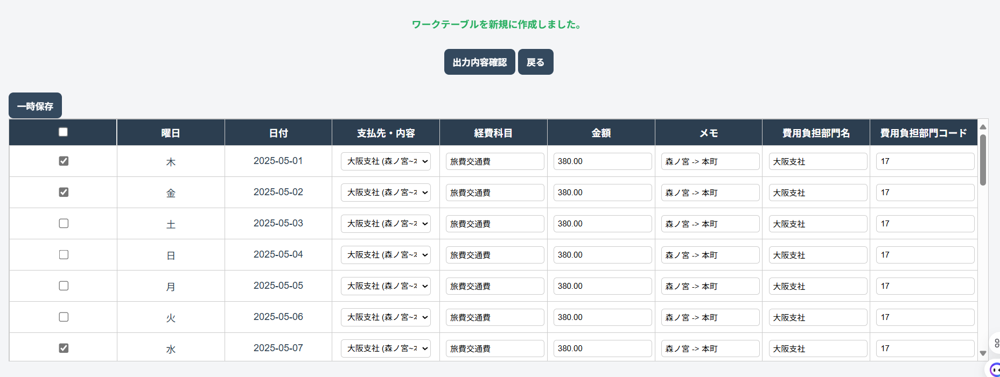

⑫：支払先・内容のプルダウンで他の経路に変更が可能。　※他の項目が自動反映されているか確認してください。

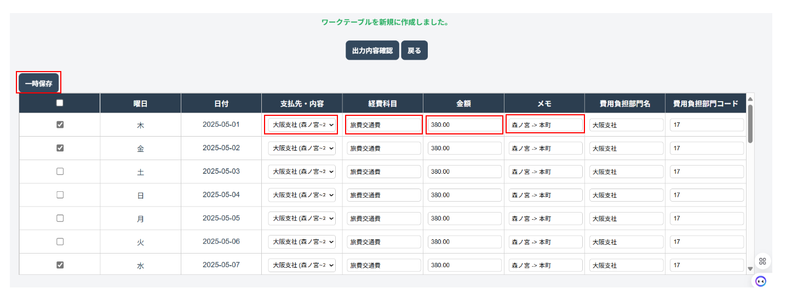

⑬：出力内容確認ボタンを押下

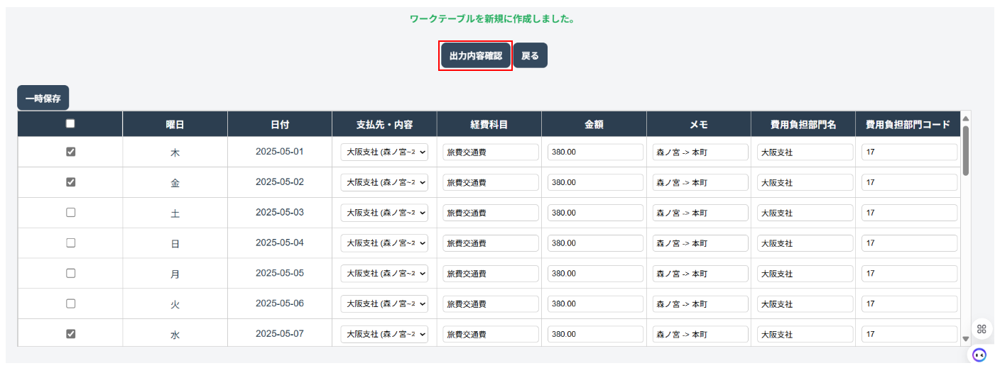

⑭：CSVファイルの出力内容に間違いがないかチェックしCSVファイルを出力ボタンを押下

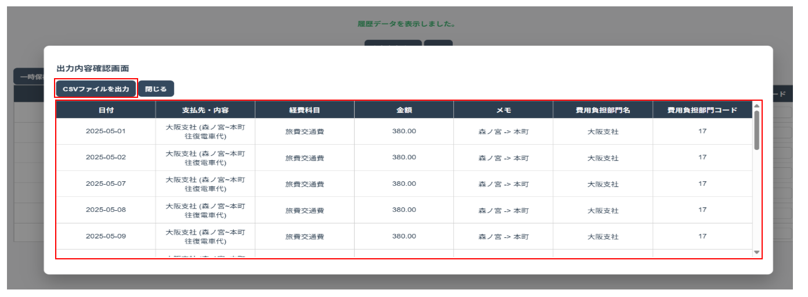

### ツール利用後の操作（CSV再アップロード）

⑮：ダウンロードフォルダに出力したCSVファイルがあることを確認

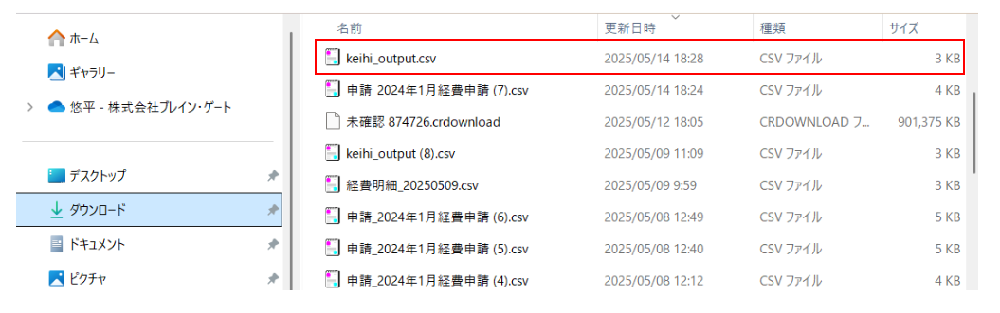

⑯：作成月の編集ボタンを押下

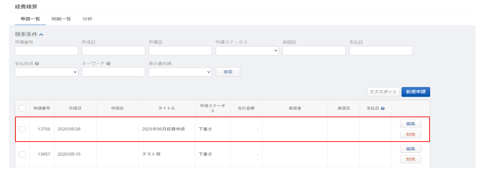

⑰：インポートボタンを押下

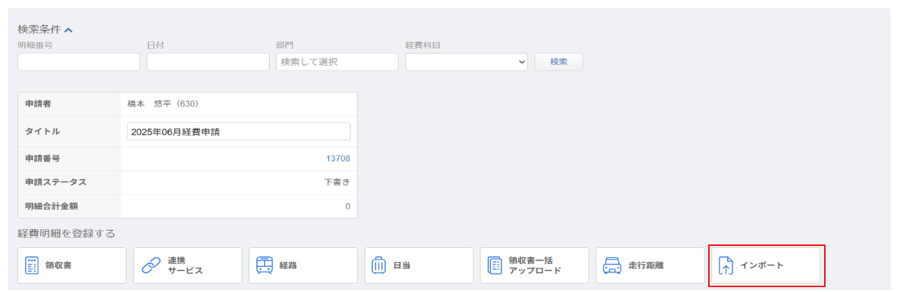

⑱：ファイルを選択を押下

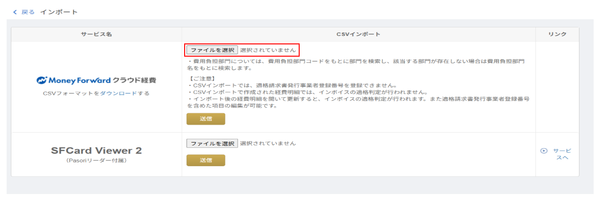

⑲：⑮で確認したCSVファイルを選択し開くを押下

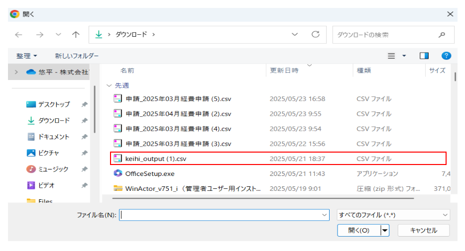

⑳：CSVファイルが選択されていることを確認し送信ボタンを押下

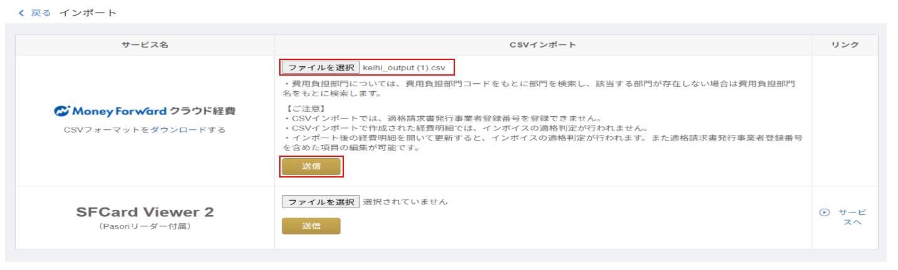

㉑：経費が正しく入力されていれば完了

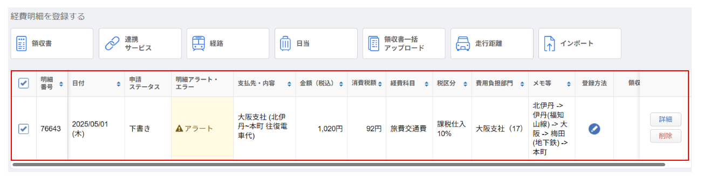
