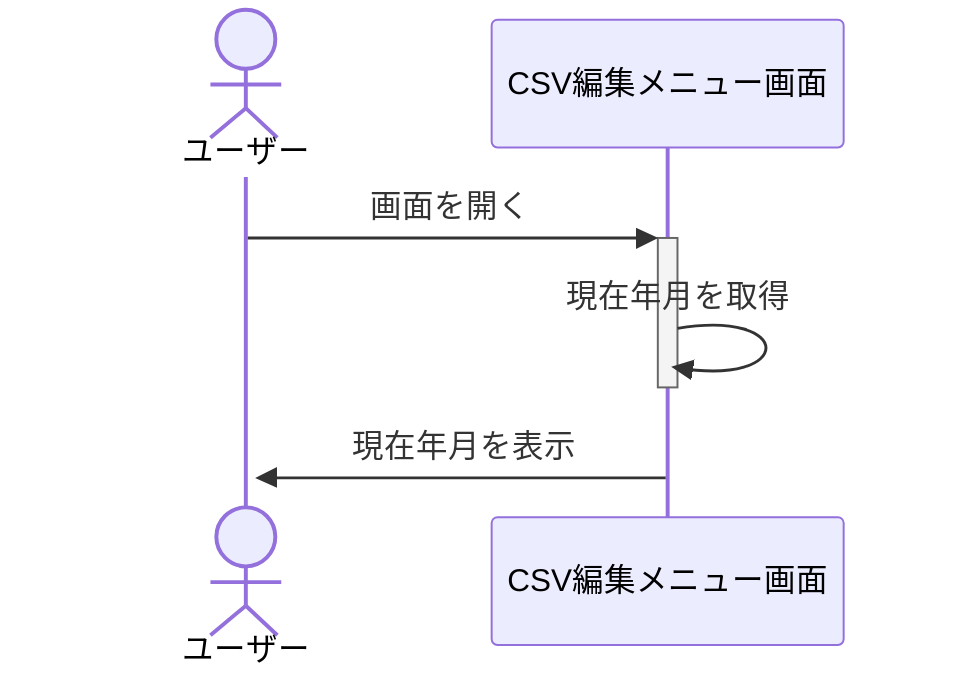
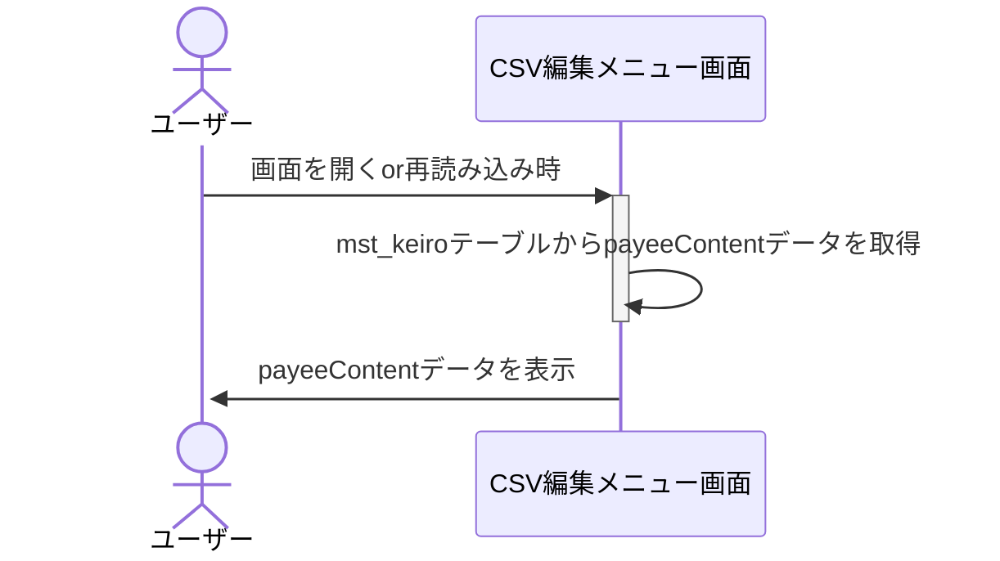
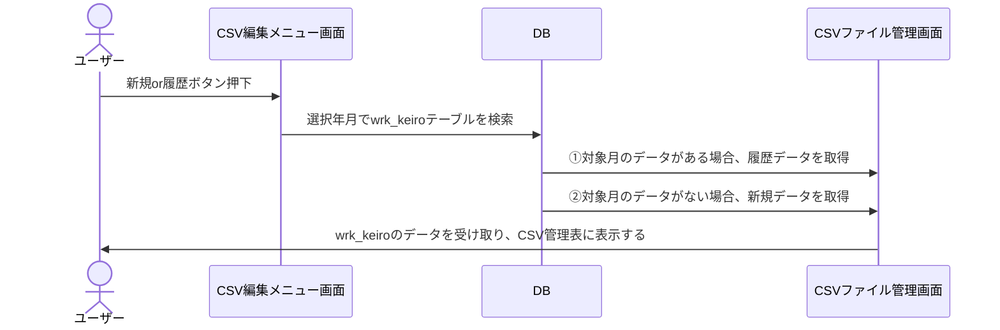
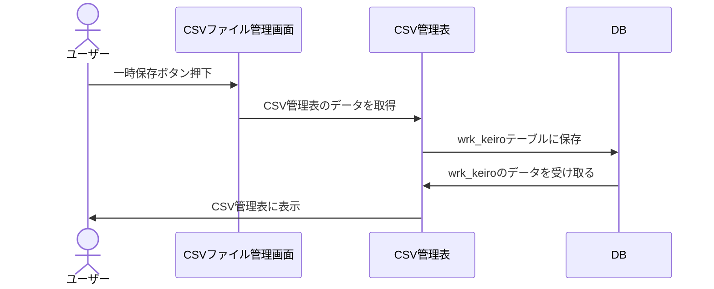
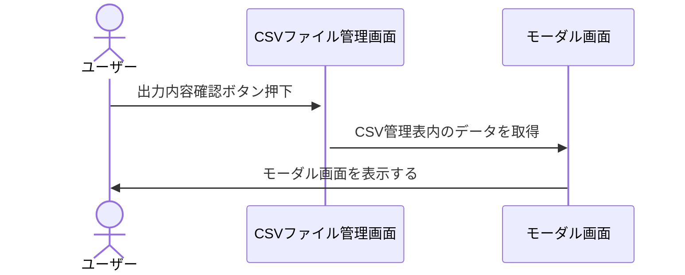
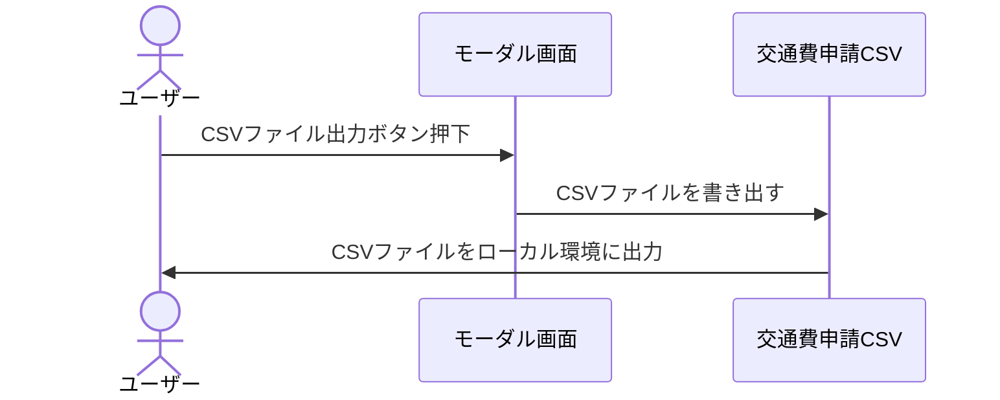

# 基本詳細設計書

1. プロジェクト名：CSVファイル簡易生成ツール
2. 作成日：YYYY/MM/DD
3. 作成者：橋本悠平

## システム概要

### 目的

経費（交通費）のCSVファイルを月単位で自動生成する

### 主な機能

1. アップロード画面でエクスポートされたCSVファイルをマスタテーブルに保存
2. CSV管理メニュー画面でワークテーブルを新規作成か既存データ表示か選択できる
3. CSV管理画面表示の際に既存か新規のワークテーブルデータを表示
4. 土日祝はダウンロード対象から外す
5. ワークテーブルの更新機能
6. モーダル画面でダウンロード内容のチェック
7. ローカルにCSVファイルをダウンロード

### 対象ユーザー

同一の経路で出勤することが多い従業員

### 開発環境

1. 言語：Java（version17）
2. フレームワーク：Spring boot
3. DB：MySQL

## 画面設計

### CSV編集メニュー画面

### CSVファイルアップロード画面

### CSVファイル管理画面

### モーダル画面

## 機能仕様

### CSV編集メニュー画面 【①】

CSVファイルアップロード画面に遷移する

### CSV編集メニュー画面 【②】

CSV編集メニュー画面表示の際にmst_keiroテーブルの支払先・内容を反映する

### CSV編集メニュー画面 【③】

CSV編集メニュー画面表示の際に現在時刻を反映する

### CSV編集メニュー画面 【④】

押下時にCSVファイル管理画面へ遷移し、履歴wrk_keiroデータを表示

### CSV編集メニュー画面 【⑤】

押下時にCSVファイル管理画面へ遷移し、新規wrk_keiroデータを表示

### CSVファイルアップロード画面 【①】

押下時にエクスプローラーを開く

### CSVファイルアップロード画面 【②】

押下時にCSVファイルをアップロードする

### CSVファイルアップロード画面 【③】

押下時にCSV編集メニュー画面へ遷移する

### CSVファイル管理画面 【①】

メッセージを表示する

### CSVファイル管理画面 【②】

モーダル画面を表示する

### CSVファイル管理画面 【③】

押下時にCSV編集メニュー画面へ遷移する

### CSVファイル管理画面 【④】

押下時にCSV管理表内のデータをwrk_keiroテーブルに保存する

### CSVファイル管理画面 【⑤】

wrk_keiroテーブルのデータを表示する

### CSVファイル管理画面 【⑥】

押下時に全選択と全選択解除する

### CSVファイル管理画面 【⑦】

選択時にmst_keiroテーブルのpayeecontentから同じデータを検索しCSV管理表の他項目を自動反映する

### モーダル画面 【①】

押下時にローカルへCSVファイルをダウンロードする

### モーダル画面 【②】

押下時にモーダル画面を閉じる

### モーダル画面 【③】

ダブルクリックでモーダル画面を閉じる

## 現在年月取得時シーケンス図

## 経路選択時シーケンス図

## 新規or履歴ボタン押下時シーケンス図

## 一時保存ボタン押下時シーケンス図

## 出力内容確認ボタン押下時シーケンス図

## CSVファイル出力ボタン押下時シーケンス図

## データ設計

```mermaid
erDiagram

    MST_KEIRO ||--o{ WRK_KEIRO : "IDで関連付ける"
    WRK_KEIRO ||--o{ out_result : produces
    WRK_KEIRO }o--|| mst_holiday : refers 

    MST_KEIRO {
        int id "ID"
        int detail_id "明細番号"
        int related_id "関連明細番号"
        date application_date "申請日"
        int employee_id "従業員番号"
        string employee_name "従業員名"
        string payee_content "支払先・内容"
        string expense_category "経費科目"
        float converted_amount "円換算金額"
        float total_with_related "関連明細との合計"
        float total_tax_with_related "関連明細との消費税額合計"
        string memo "メモ"
        int inhouse_attendees "自社出席者"
        int inhouse_attendees_count "自社出席者人数"
        int external_attendees "他社出席者"
        int external_attendees_count "他社出席者人数"
        int total_attendees "出席者数"
        float amount_per_attendee "出席者あたりの円換算金額"
        string department_code "費用負担部門コード"
        string department_name "費用負担部門名"
        string project_name "プロジェクト名"
        string project_code "プロジェクトコード"
        string tax_category "税区分"
        string invoice_scheme "インボイス経過措置"
        float amount_inclusive_tax "金額（税込）"
        string currency "通貨"
        float exchange_rate "為替レート"
        float tax_amount "消費税額"
        string debit_account "借方勘定科目"
        string debit_sub_account "借方補助科目"
        string credit_account "貸方勘定科目"
        string credit_sub_account "貸方補助科目"
        string source_of_entry "明細取得元"
        bool journal_entry_created "仕訳作成済"
        int pre_approval_number "事前申請番号"
        string pre_approval_title "事前申請タイトル"
        int expense_request_number "経費申請番号"
        date request_date "申請日"
        string request_status "申請ステータス"
        string expense_request_title "経費申請タイトル"
        int created_by_id "作成者番号"
        string created_by_name "作成者名"
        datetime created_at "作成日時"
        int updated_by_id "更新者番号"
        string updated_by_name "更新者名"
        datetime updated_at "更新日時"
        string aggregate_title "集計タイトル"
    }

    mst_holiday {
        DATE holiday_date PK
        VARCHAR name
    }

    out_result {
        BIGINT id PK
        BIGINT wrk_id FK
        DATETIME exported_at
        VARCHAR exported_by
    }

    WRK_KEIRO {
        int id pk "ワークID"
        int mst_id FK "元データとの関連（MST_KEIRO.id）"
        date application_date "申請日"
        string payee "支払先・内容"
        string expense_category "経費科目"
        float amount "金額"
        string memo "メモ"
        string department_name "費用負担部名"
        string department_code "費用負担部コード"
    }

```

## テスト計画

先に開発を進めます。（機能が一通り完成したら再度作成）
