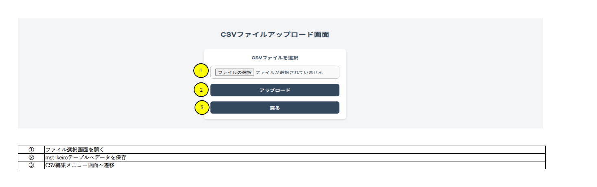
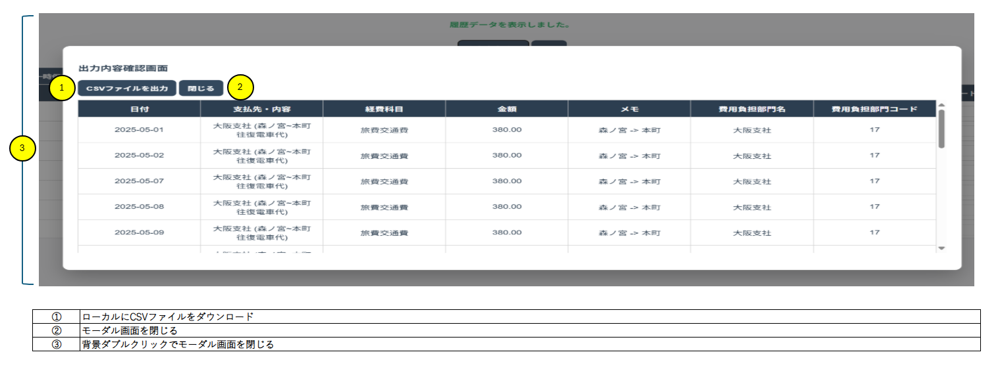
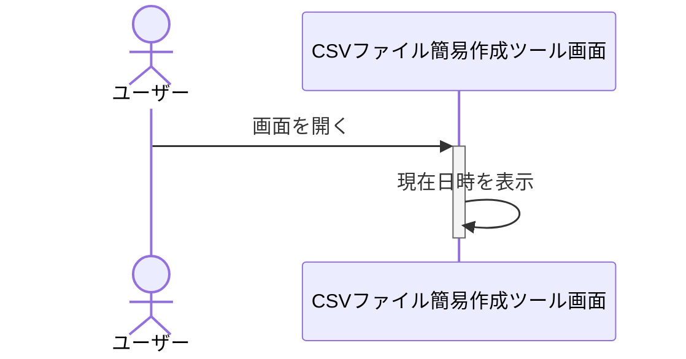
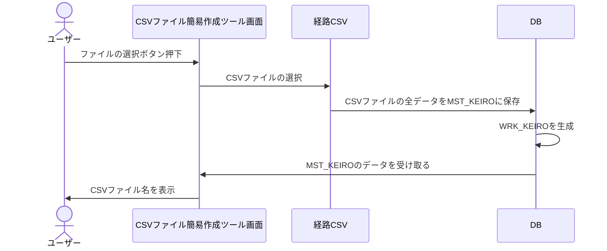
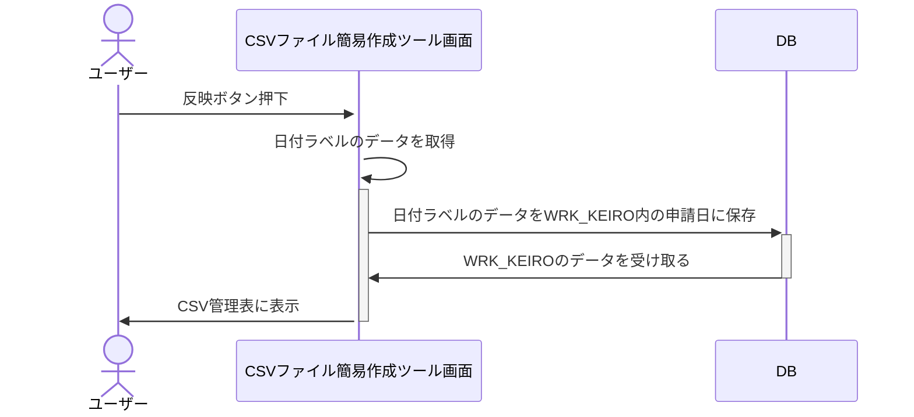
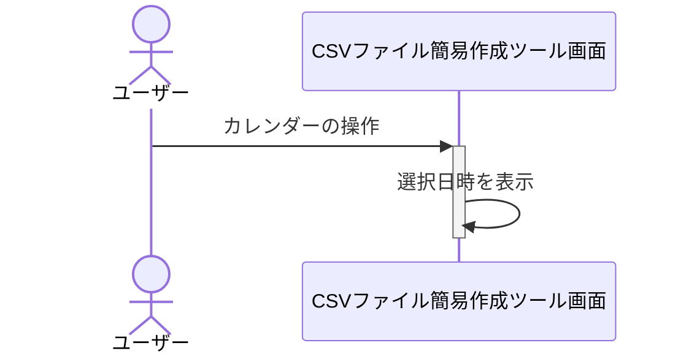
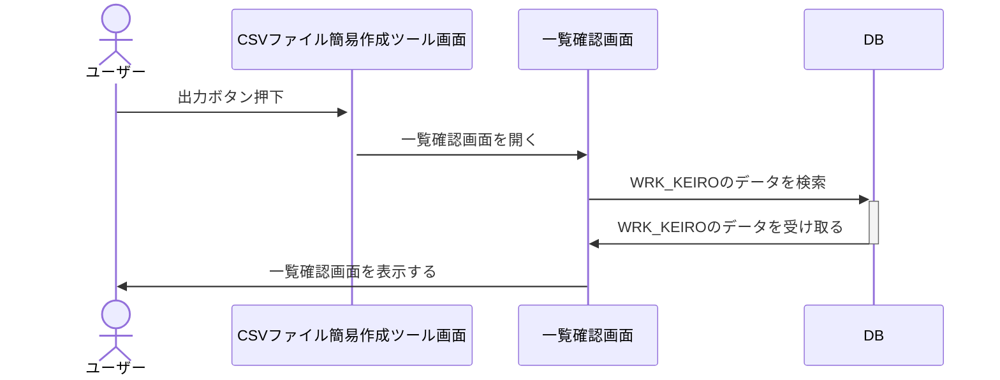
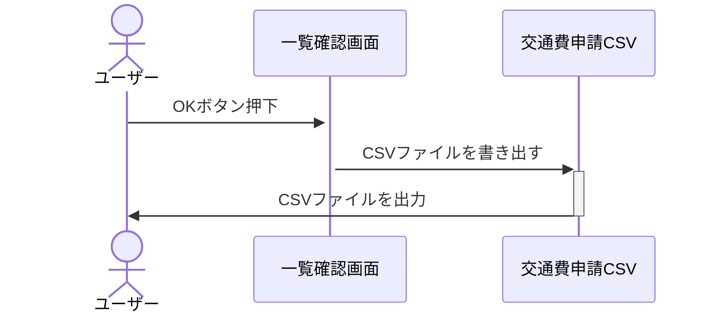

# 基本詳細設計書

1. プロジェクト名：CSVファイル簡易生成ツール
2. 作成日：YYYY/MM/DD
3. 作成者：橋本悠平

## システム概要

### 目的

経費（交通費）のCSVファイルを月単位で自動生成する

### 主な機能

1. アップロード画面でエクスポートされたCSVファイルをマスタテーブルに保存
2. CSV管理メニュー画面でワークテーブルを新規作成か既存データ表示か選択できる
3. CSV管理画面表示の際に既存か新規のワークテーブルデータを表示
4. 土日祝はダウンロード対象から外す
5. ワークテーブルの更新機能
6. モーダル画面でダウンロード内容のチェック
7. ローカルにCSVファイルをダウンロード

### 対象ユーザー

同一の経路で出勤することが多い従業員

### 開発環境

1. 言語：Java（version17）
2. フレームワーク：Spring boot
3. DB：MySQL

## 画面設計

### CSV編集メニュー画面

### CSVファイルアップロード画面

### CSVファイル管理画面

### モーダル画面

## 機能仕様

### CSV編集メニュー画面 【①】

CSVファイルアップロード画面に遷移する

### CSV編集メニュー画面 【②】

CSV編集メニュー画面表示の際にmst_keiroテーブルの支払先・内容を反映する

### CSV編集メニュー画面 【③】

CSV編集メニュー画面表示の際に現在時刻を反映する

### CSV編集メニュー画面 【④】

押下時にCSVファイル管理画面へ遷移し、履歴wrk_keiroデータを表示

### CSV編集メニュー画面 【⑤】

押下時にCSVファイル管理画面へ遷移し、新規wrk_keiroデータを表示

### CSVファイルアップロード画面 【①】

押下時にエクスプローラーを開く

### CSVファイルアップロード画面 【②】

押下時にローカル環境へCSVファイルをダウンロードする

### CSVファイルアップロード画面 【③】

押下時にCSV編集メニュー画面へ遷移する

### CSVファイル管理画面 【①】

メッセージを表示する

### CSVファイル管理画面 【②】

モーダル画面を表示する

### CSVファイル管理画面 【③】

押下時にCSV編集メニュー画面へ遷移する

### CSVファイル管理画面 【④】

押下時にCSV管理表内のデータをwrk_keiroテーブルに保存する

### CSVファイル管理画面 【⑤】

wrk_keiroテーブルのデータを表示する

### CSVファイル管理画面 【⑥】

押下時に全選択と全選択解除する

### CSVファイル管理画面 【⑦】

選択時にmst_keiroテーブルのpayeecontentから同じデータを検索しCSV管理表の他項目を自動反映する

### モーダル画面 【①】

押下時にローカルへCSVファイルをダウンロードする

### モーダル画面 【②】

押下時にモーダル画面を閉じる

### モーダル画面 【③】

ダブルクリックでモーダル画面を閉じる

## 機能詳細

### CSV編集メニュー画面 ①

WEBアプリ起動時および再読み込み時に、現在の年月を自動で取得する

- [ ] 入力なし：自動入力

- [ ] 出力あり：
当月の年月情報（例：2025/4など）

#### 実装方法：詳細

- コントローラークラス
  - 日付取得処理を呼び出す
- サービスクラス
  - 現在の日付を取得する
  - 画面の作成年月に反映

### ファイルの選択：詳細

ユーザーがファイル選択ボタン押下時にダイアログを表示しローカルからCSVファイルを選択する。選択したファイル名が画面に表示される。

- [ ] 入力あり：
ローカルに保存されている経路CSVファイル（例：申請_2024年〇月経費申請.csv）

- [ ] 出力あり：
選択されたファイル名を画面に表示する

#### 実装方法

- コントローラークラス
- CSVファイル選択処理を呼び出す
- サービスクラス
  - JFileChooserを使ってCSVファイルを選択するダイアログを開く
  - ファイルが選択されたらパスとファイル名を取得する。

### 反映ボタン押下：詳細

ユーザーが選択した経路CSVファイルをMST_KEIROに保存する。

- [ ] 入力あり：
選択された経路CSVファイルの内容

- [ ] 出力あり：
CSV管理表にWRK_KEIROの内容を表示

#### 反映ボタン押下：実装方法

- コントローラークラス：CSVをインポート
- サービスクラス
  - DBへのデータ保存（経路CSV内のすべて）
  - DBへのデータ保存（交通費申請CSV作成用の項目）
- モデルクラス
  - エンティティクラス
    - DBへのデータ保存（経路CSV内のすべて）を管理
    - DBへのデータ保存（交通費申請CSV作成用の項目）を管理

### カレンダーの選択：詳細

ユーザーがカレンダーを選択した際にDate Pickerを使って選択年月を日付ラベルに反映する

- [ ] 入力あり：
選択された年月情報（例：2025年5月など）

- [ ] 出力あり：
選択された年月（例：2025年5月など）

#### 年月の選択：実装方法

- コントローラークラス
  - 選択された年月を取得する

### チェックボックス押下：詳細

チェックボックスの操作でCSV管理表の特定日のWRK_KEIROデータを反映か未反映にする

- [ ] 入力あり：
チェックボックスの操作（チェックの有無）
チェック有：該当日のデータを反映する
チェック無：該当日のデータを未反映にする

- [ ] 出力あり：
チェック有：対象日のCSV管理表にWRK_KEIROの情報を反映
チェック無：対象日のCSV管理表の内容が未反映として表示される

#### チェックボックス押下：実装方法

- コントローラークラス
  - チェックされた日付の更新処理を呼び出す
  - 更新後のCSV管理表のデータ取得処理を呼び出す
- サービスクラス
  - チェックされた日付の反映状態を更新処理
    - チェックがはずれた日付の反映状態を更新処理
    - 反映状態を更新したCSV管理表データの取得処理

### 編集ボタン押下：詳細

ユーザーが編集ボタンを押下することで該当データをモーダルで編集し保存できる

- [ ] 入力あり：
編集ボタンがクリックされることで、該当する行のデータが選択され、その内容がモーダルに表示される。

- [ ] 出力あり：

ユーザーが更新をクリックすると編集されたデータがCSV管理表に反映され、表示が更新される。

#### 編集ボタン押下：実装方法

- コントローラークラス
  - WRK_KEIROデータを更新する
  - 更新後のWRK_KEIROデータを取得する
- サービスクラス
  - WRK_KEIROデータを取得し更新処理

### 出力ボタン押下：詳細

ユーザーが出力ボタン押下後にWRK_KEIROにCSV管理表のデータを保存する。一覧確認画面を表示し一覧表にWRK_KEIROのデータを表示、ラベル部分に「交通費申請用のCSVファイルを出力します。よろしいですか？」を表示する。

- [ ] 入力あり：
ユーザーが出力ボタンを押下すると一覧確認画面を表示し出力内容確認メッセージを表示する（例：交通費申請CSVを出力します。よろしいですか？）

- [ ] 出力あり：
CSV管理表のデータをWRK_KEIROに保存し一覧確認画面に表示する

### 出力ボタン押下：実装方法

- [ ] コントローラークラス
  - データ保存処理を呼び出す
  - データ取得処理を呼び出す
- [ ] サービスクラス
  - WRK_KEIROへのデータ保存（CSV管理表のデータすべて）
  - WRK_KEIROからデータ取得（WRK_KEIRO内のデータすべて）

### CSVファイル出力時：詳細

ローカルのダウンロードフォルダにCSVファイルを出力し画面内のラベルに「CSVファイルの出力が完了しました。」と表示する

- [ ] 入力なし：

- [ ] 出力あり：
ダウンロードフォルダへCSVファイル出力しラベル部分に「CSVファイルの出力が完了しました。」と表示する

### CSVファイル出力時： 実装方法

- コントローラークラス
  - CSVファイルの出力処理を呼び出す
  - CSVファイル出力完了メッセージを表示する
- サービスクラス
  - 一覧確認画面で書き出されたCSVファイルの出力処理を行う

## 現在年月取得時シーケンス図

## CSVファイル選択時シーケンス図

## 反映ボタン押下時シーケンス図

## カレンダー選択時シーケンス図

## 出力ボタン押下時シーケンス図

## OKボタン押下時シーケンス図

## データ設計

```mermaid
erDiagram

    MST_KEIRO ||--o{ WRK_KEIRO : "IDで関連付ける"
    WRK_KEIRO ||--o{ out_result : produces
    WRK_KEIRO }o--|| mst_holiday : refers 

    MST_KEIRO {
        int id "ID"
        int detail_id "明細番号"
        int related_id "関連明細番号"
        date application_date "申請日"
        int employee_id "従業員番号"
        string employee_name "従業員名"
        string payee_content "支払先・内容"
        string expense_category "経費科目"
        float converted_amount "円換算金額"
        float total_with_related "関連明細との合計"
        float total_tax_with_related "関連明細との消費税額合計"
        string memo "メモ"
        int inhouse_attendees "自社出席者"
        int inhouse_attendees_count "自社出席者人数"
        int external_attendees "他社出席者"
        int external_attendees_count "他社出席者人数"
        int total_attendees "出席者数"
        float amount_per_attendee "出席者あたりの円換算金額"
        string department_code "費用負担部門コード"
        string department_name "費用負担部門名"
        string project_name "プロジェクト名"
        string project_code "プロジェクトコード"
        string tax_category "税区分"
        string invoice_scheme "インボイス経過措置"
        float amount_inclusive_tax "金額（税込）"
        string currency "通貨"
        float exchange_rate "為替レート"
        float tax_amount "消費税額"
        string debit_account "借方勘定科目"
        string debit_sub_account "借方補助科目"
        string credit_account "貸方勘定科目"
        string credit_sub_account "貸方補助科目"
        string source_of_entry "明細取得元"
        bool journal_entry_created "仕訳作成済"
        int pre_approval_number "事前申請番号"
        string pre_approval_title "事前申請タイトル"
        int expense_request_number "経費申請番号"
        date request_date "申請日"
        string request_status "申請ステータス"
        string expense_request_title "経費申請タイトル"
        int created_by_id "作成者番号"
        string created_by_name "作成者名"
        datetime created_at "作成日時"
        int updated_by_id "更新者番号"
        string updated_by_name "更新者名"
        datetime updated_at "更新日時"
        string aggregate_title "集計タイトル"
    }

    mst_holiday {
        DATE holiday_date PK
        VARCHAR name
    }

    out_result {
        BIGINT id PK
        BIGINT wrk_id FK
        DATETIME exported_at
        VARCHAR exported_by
    }

    WRK_KEIRO {
        int id pk "ワークID"
        int mst_id FK "元データとの関連（MST_KEIRO.id）"
        date application_date "申請日"
        string payee "支払先・内容"
        string expense_category "経費科目"
        float amount "金額"
        string memo "メモ"
        string department_name "費用負担部名"
        string department_code "費用負担部コード"
    }

```

## テスト計画

先に開発を進めます。（機能が一通り完成したら再度作成）
