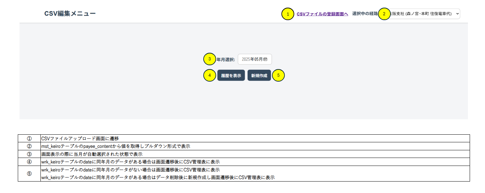

# 詳細設計書

1. プロジェクト名：CSVファイル簡易生成ツール
2. 作成日：YYYY/MM/DD
3. 作成者：橋本悠平

## 画面設計

### CSV編集メニュー画面

## 機能詳細

### CSV編集メニュー画面 ①

押下時にCSVファイルアップロード画面に遷移する

- [ ] 入力なし：なし

- [ ] 出力あり：CSVファイルアップロード画面

#### 実装方法：詳細 ①

- CsvUploadControllerクラス
  - CSVファイルアップロード画面表示処理を行う

### CSV編集メニュー画面 ②

CSV編集メニュー画面表示の際にmst_keiroテーブルのPayeeContentを反映する

- [ ] 入力あり：自動入力orユーザー選択

- [ ] 出力あり：PayeeContent

#### 実装方法：詳細 ②

- CsvDownloadControllerクラス
  - PayeeContnt取得処理を呼び出す

- CsvDownloadServiceクラス
  - mst_keiroテーブルからPayeeContentを取得する

### CSV編集メニュー画面 ③

CSV編集メニュー画面表示の際に現在時刻を反映する

- [ ] 入力なし：自動入力

- [ ] 出力あり：現在時刻

#### 実装方法：詳細 ③

- CsvDownloadControllerクラス
  - 現在年月の取得処理を呼び出す

- CsvDownloadServiceクラス
  - 現在の年月を取得する

### CSV編集メニュー画面 ④

押下時にCSVファイル管理画面へ遷移し、履歴wrk_keiroデータを表示

- [ ] 入力なし：選択年月+選択経路

- [ ] 出力あり：wrk_keiroデータ

#### 実装方法：詳細 ④

- CsvDownloadControllerクラス
  - wrk_keiroデータ取得処理を呼び出す

- CsvDownloadServiceクラス
  - wrk_keiroデータを取得する

### CSV編集メニュー画面 ⑤

押下時にCSVファイル管理画面へ遷移し、新規wrk_keiroデータを表示

- [ ] 入力なし：選択年月+選択経路

- [ ] 出力あり：wrk_keiroデータ

#### 実装方法：詳細 ⑤

- CsvDownloadControllerクラス
  - wrk_keiroデータ削除よりを呼び出す
  - wrk_keiroデータ作成処理を呼び出す
  - wrk_keiroデータ取得処理を呼び出す

- CsvDownloadServiceクラス
  - wrk_keiroデータを削除する
  - wrk_keiroデータを作成する
  - wrk_keiroデータを取得する
