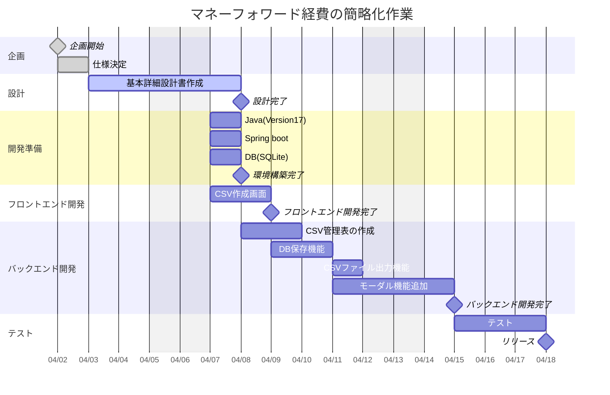

# マネーフォワード経費簡略化 開発スケジュール

| No | 分類     | 作業項目       | 担当者     | 項目状況 | 予定開始日 | 予定終了日 | 予定工数(h) | 実績開始日 | 実績終了日 | 実績工数(h) |
|----|----------|----------------|------------|----------|-------------|-------------|-------------|-------------|-------------|--------------|
| 1 | 企画     | 企画 | 橋本悠平 | ー | 2025/4/2 | ー | ー | 2025/4/2 | ー | ー |
| 2 | 設計     | 基本詳細設計書作成 | 橋本悠平 | 完了 | ー | ー | ー | ー | ー | ー |
| 3 | 基本設計 | CSVダウンロード画面 | 橋本悠平 | 完了 | 2025/4/3 | 2025/4/4 | 14.0 | 2025/4/3 | 2025/4/10 | ー |
| 4 | 基本設計 | CSVアップロード画面 | 橋本悠平 | 完了 | 2025/4/7 | 2025/4/8 | 14.0 | 2025/4/7 | 2025/4/10 | ー |
| 5 | 開発準備 | Java17 | 橋本悠平 | 完了 | 2025/4/8 | 2025/4/8 | 2.0 | 2025/4/11 | 2025/4/11 | 2.0 |
| 6 | 開発準備 | Spring Boot | 橋本悠平 | 完了 | 2025/4/8 | 2025/4/8 | 2.0 | 2025/4/11 | 2025/4/11 | 2.0 |
| 7 | 開発準備 | MySQL | 橋本悠平 | 完了 |  2025/4/8  | 2025/4/8 | 2.0 | 2025/4/11 | 2025/4/11 | 2.0 |
| 8 | フロントエンド開発 | CSVダウンロード画面 | 橋本悠平 | 完了 | 2025/4/10 | 2025/4/10 | 7.0 | 2025/4/12 | 2025/4/12 | 7.0 |
| 9 | フロントエンド開発 | CSVアップロード画面 | 橋本悠平 | 完了 | 2025/4/11 | 2025/4/11 | 7.0 | 2025/4/13 | 2025/4/13 | 7.0 |
| 10 | バックエンド開発 | DB保存機能追加 | 橋本悠平 | 開発中 | 2025/4/12 | 2025/4/12 | 3.5 | 2025/4/14 | ー | ー |
| 11 | バックエンド開発 | CSV管理表追加 | 橋本悠平 | 開発中 | 2025/4/12 | 2025/4/12 | 3.5 | ー | ー | ー |
| 12 | バックエンド開発 | CSVダウンロード機能追加 | 橋本悠平 | 開発中 | 2025/4/13 | 2025/4/13 | 3.5 | ー | ー | ー |
| 13 | バックエンド開発 | モーダル機能追加 | 橋本悠平 | 開発中 | 2025/4/13 | 2025/4/13 | 3.5 | ー | ー | ー |
| 14 | 単体テスト | 経費申請完了確認 | 橋本悠平 | 未実施 | 2025/4/14 | 2025/4/16 | 21.0 | ー | ー | ー |
| 15 | リリース | ー | 橋本悠平 | 未実施 | 2025/4/17 | 2025/4/17 | 7.0 | ー | ー | ー |

