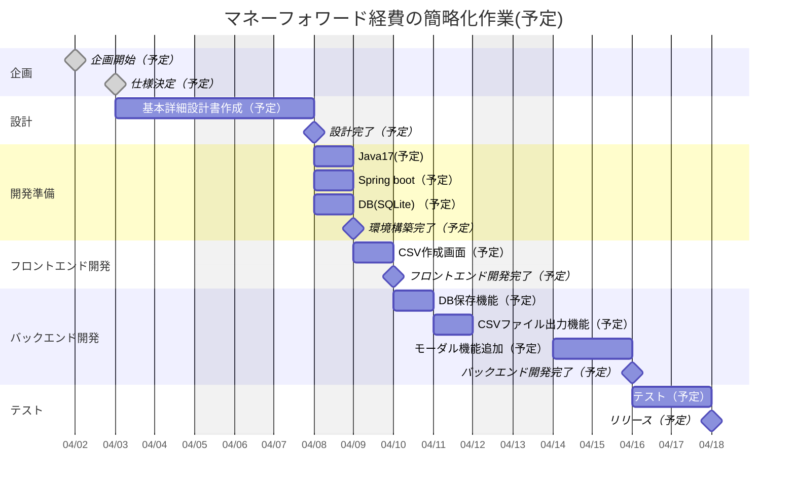
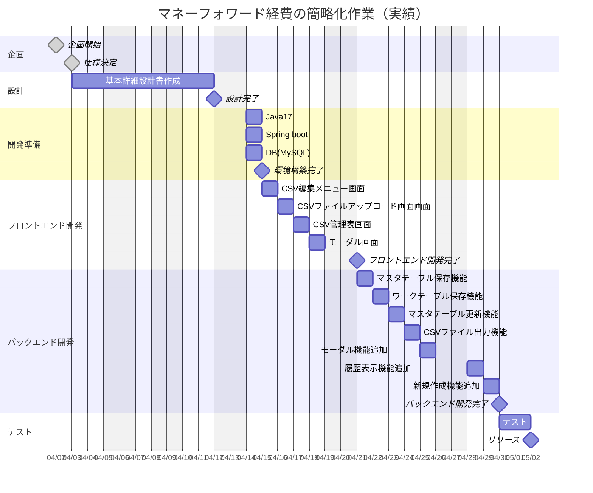

# マネーフォワード経費簡略化 開発スケジュール

```mermaid
gantt
  title マネーフォワード経費の簡略化作業(予定)
  dateFormat  YYYY-MM-DD
  axisFormat  %m/%d  
  excludes    weekends, 2025-04-08, 2025-04-09  
  tickInterval 1day

  section 企画
    企画開始（予定）          : done, milestone, des1, 2025-04-02,   
    仕様決定（予定）          : done, milestone, des1-1, 2025-04-03,   

  section 設計
    基本詳細設計書作成（予定）     : des2, after des1-1, 3d
    設計完了（予定）             : milestone, 2025-04-08,

  section 開発準備
    Java17(予定)      　　　　　　: des3-1, 2025-04-08, 1d
    Spring boot（予定）          : des3-2, 2025-04-08, 1d
    DB(SQLite) （予定）          : des3-3, 2025-04-08, 1d
    環境構築完了（予定）           : milestone, m3, 2025-04-09,    

  section フロントエンド開発
    CSV作成画面（予定）           : des4-1, 2025-04-09, 1d
    フロントエンド開発完了（予定）  : milestone, after des4-1

  section バックエンド開発
    DB保存機能（予定）             : des5-1, 2025-04-10, 1d
    CSVファイル出力機能（予定）     : des5-3, after des5-1, 1d
    モーダル機能追加（予定）        : des5-4, after des5-3, 2d
    バックエンド開発完了（予定）     :milestone,m5, after des5-4,

  section テスト
    テスト（予定）               : des6, after m5, 2d
    リリース（予定）             : milestone,
```

```mermaid
gantt
  title マネーフォワード経費の簡略化作業（実績）
  dateFormat  YYYY-MM-DD
  axisFormat  %m/%d  
  excludes    weekends, 2025-04-08, 2025-04-09  
  tickInterval 1day

  section 企画
    企画開始          : done, milestone, des1, 2025-04-02,    
    仕様決定          : done, milestone, des1-2, 2025-04-03,    

  section 設計
    基本詳細設計書作成     : des2, after des1-2, 5d 
    設計完了             : milestone, 2025-04-12,

  section 開発準備  
    Java17     　　　　　　: des3-1, 2025-04-14, 1d
    Spring boot          : des3-2, 2025-04-14, 1d
    DB(MySQL)  　         : des3-3, 2025-04-14, 1d    
    環境構築完了           : milestone, m3, 2025-04-15,

  section フロントエンド開発
    CSV編集メニュー画面                 : des4-1, 2025-04-15, 1d
    CSVファイルアップロード画面画面      : des4-2, after des4-1, 1d
    CSV管理表画面                       : des4-3, after des4-2, 1d
    モーダル画面                        : des4-4, after des4-3, 1d
    フロントエンド開発完了               : milestone, after des4-4

  section バックエンド開発
    マスタテーブル保存機能             : des5-1, after des4-4, 1d
    ワークテーブル保存機能             : des5-2, after des5-1, 1d
    マスタテーブル更新機能             : des5-3, after des5-2, 1d
    CSVファイル出力機能                : des5-4, after des5-3, 1d
    モーダル機能追加        　　　　　　: des5-5, after des5-4, 1d
    履歴表示機能追加        　　　　　　: des5-6, after des5-5, 1d
    新規作成機能追加                   : des5-7, after des5-6, 1d
    バックエンド開発完了               :milestone,m5, after des5-7,

  section テスト
    テスト               : des6, after m5, 2d
    リリース             : milestone,
```

active
