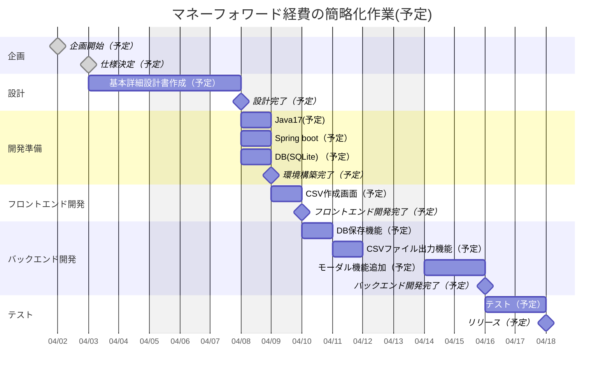
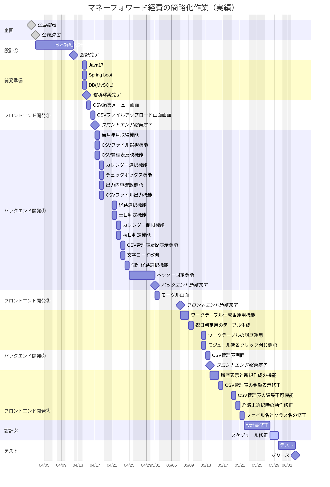

# マネーフォワード経費簡略化 開発スケジュール

```mermaid
gantt
  title マネーフォワード経費の簡略化作業(予定)
  dateFormat  YYYY-MM-DD
  axisFormat  %m/%d  
  excludes    weekends, 2025-04-08, 2025-04-09  
  tickInterval 1day

  section 企画
    企画開始（予定）          : done, milestone, des1, 2025-04-02,   
    仕様決定（予定）          : done, milestone, des1-1, 2025-04-03,   

  section 設計
    基本詳細設計書作成（予定）     : des2, after des1-1, 3d
    設計完了（予定）             : milestone, 2025-04-08,

  section 開発準備
    Java17(予定)      　　　　　　: des3-1, 2025-04-08, 1d
    Spring boot（予定）          : des3-2, 2025-04-08, 1d
    DB(SQLite) （予定）          : des3-3, 2025-04-08, 1d
    環境構築完了（予定）           : milestone, m3, 2025-04-09,    

  section フロントエンド開発
    CSV作成画面（予定）           : des4-1, 2025-04-09, 1d
    フロントエンド開発完了（予定）  : milestone, after des4-1

  section バックエンド開発
    DB保存機能（予定）             : des5-1, 2025-04-10, 1d
    CSVファイル出力機能（予定）     : des5-3, after des5-1, 1d
    モーダル機能追加（予定）        : des5-4, after des5-3, 2d
    バックエンド開発完了（予定）     :milestone,m5, after des5-4,

  section テスト
    テスト（予定）               : des6, after m5, 2d
    リリース（予定）             : milestone,
```

```mermaid
gantt
  title マネーフォワード経費の簡略化作業（実績）
  dateFormat  YYYY-MM-DD
  axisFormat  %m/%d  
  excludes    weekends, 2025-04-08, 2025-04-09, 2025-04-28, 2025-04-29, 2025-05-02, 2025-05-05, 2025-05-06, 2025-05-23, 2025-05-26
  tickInterval 4day

  section 企画
    企画開始          : done, milestone, des1, 2025-04-02,    
    仕様決定          : done, milestone, des1-2, 2025-04-03,    

  section 設計①
    基本詳細設計書作成     : des2, after des1-2, 5d 
    設計完了             : milestone, 2025-04-12,

  section 開発準備  
    Java17     　　　　　　: des3-1, 2025-04-14, 1d
    Spring boot          : des3-2, 2025-04-14, 1d
    DB(MySQL)  　         : des3-3, 2025-04-14, 1d    
    環境構築完了           : milestone, m3, 2025-04-15,

  section フロントエンド開発①
    CSV編集メニュー画面                 : des4-1, 2025-04-15, 1d
    CSVファイルアップロード画面画面      : des4-2, after des4-1, 1d
    フロントエンド開発完了               : milestone, after des4-4

  section バックエンド開発①
    当月年月取得機能             : des5-1, after des4-2, 1d
    CSVファイル選択機能             : des5-1, after des4-2, 1d
    CSV管理表反映機能             : des5-1, after des4-2, 1d
    カレンダー選択機能             : des5-2, after des5-1, 1d
    チェックボックス機能             : des5-2, after des5-1, 1d
    出力内容確認機能                : des5-2, after des5-1, 1d
    CSVファイル出力機能                : des5-2, after des5-1, 1d
    経路選択機能        　　　　　　: des5-3, after des5-2, 1d
    土日判定機能        　　　　　　: des5-3, after des5-2, 1d
    カレンダー制限機能                   : des5-4, after des5-3, 1d
    祝日判定機能                   : des5-4, after des5-3, 1d
    CSV管理表履歴表示機能                   : des5-5, after des5-4, 1d
    文字コード改修                   : des5-5, after des5-4, 1d
    個別経路選択機能                   : des5-6, after des5-5, 1d
    ヘッダー固定機能                   : des5-7, after des5-6, 2d
    バックエンド開発完了               :milestone,m5, after des5-7,

  section フロントエンド開発②
    モーダル画面                        : des5-8, after des5-7, 1d  　  
    フロントエンド開発完了               : milestone, after des5-8

  section バックエンド開発②
　  ワークテーブル生成＆運用機能                       : des5-9, after des5-8, 2d 
　　祝日判定用のテーブル生成                       : des5-10, after des5-9, 1d
　　ワークテーブルの履歴運用                       : des5-11, after des5-10, 1d 
　　モジュール背景クリック閉じ機能                       : des5-11, after des5-10, 1d 

  section フロントエンド開発③
    CSV管理表画面                       : des5-12, after des5-11, 1d  　  
    フロントエンド開発完了               : milestone, after des5-12

  section バックエンド開発②
    履歴表示と新規作成の機能                      : des5-13, after des5-12, 2d 
    CSV管理表の金額表示修正                      : des5-14, after des5-13, 1d 
    CSV管理表の編集不可機能                      : des5-15, after des5-14, 1d 
    経路未選択時の動作修正                      : des5-16, after des5-15, 1d 
    ファイル名とクラス名の修正                      : des5-17, after des5-16, 1d 

  section 設計②
    設計書修正                      : des5-18, after des5-17, 2d 
    スケジュール修正                      : active, des5-19, after des5-18, 2d

  section テスト
    テスト               : des6, after des5-19, 2d
    リリース             : milestone,
```

active
