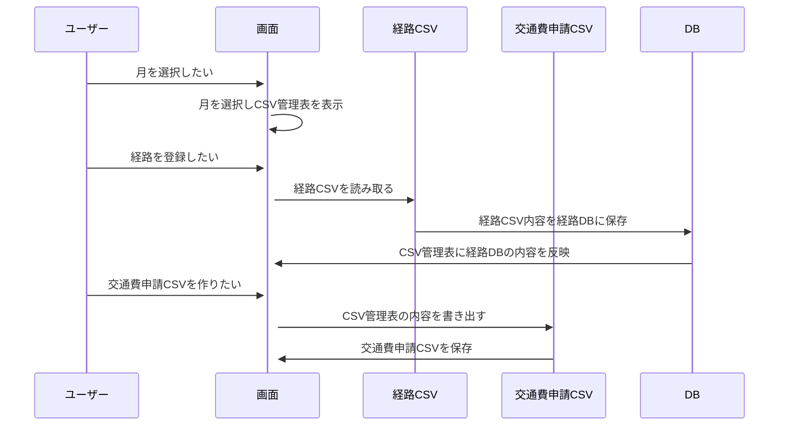
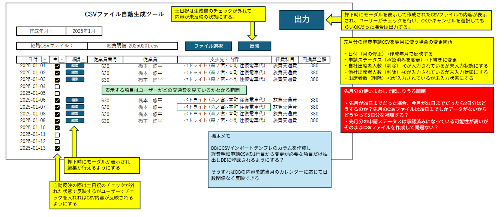

# 基本詳細設計書

1. プロジェクト名：CSVファイル自動生成
2. 作成日：YY/MM/DD
3. 作成者：橋本悠平

## システム概要

### 目的

経費（交通費）のCSVファイルを月単位で自動生成する

### 主な機能

1. 経路CSVファイルを経路DBに保存する
2. 選択された月のCSV管理表に経路DBの内容を一括表示する
3. 表示内容で問題なければ交通費申請CSVファイルを選択月で生成する

### 対象ユーザー

同一の経路で出勤することが多い従業員

### 開発環境

1. 言語：Java（version17）
2. フレームワーク：Spring boot
3. DB：SQLite

## 機能仕様

### 月の選択

交通費申請CSVファイルを何月で作成するか選択できる機能を追加

### 経路CSVファイルの選択

経路CSVファイルを選択する機能を追加

### 経路CSVファイルの読み取り

経路CSVファイルを読み取る機能を追加

### 経路DB登録

経路CSVファイルの経路情報を経路DBに登録する機能を追加

### 複数経路の切り替え

経路DBからどの経路情報を交通費申請CSVファイル作成表に表示するか選択できる機能を追加

### 経路DBから情報を表示

選択された経路情報を交通費CSVファイル作成表に一括表示する機能を追加

### 日付単位で経路情報を切替

選択された日付部分の経路情報を切替できる機能を追加

### 交通費申請CSVファイルの対象外処理

選択された日付の経路情報を交通費申請CSVファイルに含めない機能を追加

### 交通費申請CSVファイルの内容編集

交通費CSVファイル作成表の内容を交通費申請CSVファイルに書き込む機能を追加

### 交通費申請CSVファイルの生成

交通費申請CSVファイルに書き込まれた内容でCSVファイルの生成機能を追加

# シーケンス図

## 機能詳細

## データ設計

```mermaid
erDiagram
    CsvFile ||--o{ KEIRODB : "保存"

    CsvFile {
        int id "ID"
        int csv_file_id "CSVファイルID"
        int detail_id "明細番号"
        int related_id "関連明細番号"
        date date "日付"
        int employee_id "従業員番号"
        string employee_name "従業員名"
        string payee_content "支払先・内容"
        string expense_category "経費科目"
        float converted_amount "円換算金額"
        float total_with_related "関連明細との合計"
        float total_tax_with_related "関連明細との消費税額合計"
        string memo "メモ"
        int inhouse_attendees "自社出席者"
        int inhouse_attendees_count "自社出席者人数"
        int external_attendees "他社出席者"
        int external_attendees_count "他社出席者人数"
        int total_attendees "出席者数"
        float amount_per_attendee "出席者あたりの円換算金額"
        string department_code "費用負担部門コード"
        string department_name "費用負担部門名"
        string project_name "プロジェクト名"
        string project_code "プロジェクトコード"
        string tax_category "税区分"
        string invoice_scheme "インボイス経過措置"
        float amount_inclusive_tax "金額（税込）"
        string currency "通貨"
        float exchange_rate "為替レート"
        float tax_amount "消費税額"
        string debit_account "借方勘定科目"
        string debit_sub_account "借方補助科目"
        string credit_account "貸方勘定科目"
        string credit_sub_account "貸方補助科目"
        string source_of_entry "明細取得元"
        bool journal_entry_created "仕訳作成済"
        int pre_approval_number "事前申請番号"
        string pre_approval_title "事前申請タイトル"
        int expense_request_number "経費申請番号"
        date request_date "申請日"
        string request_status "申請ステータス"
        string expense_request_title "経費申請タイトル"
        int created_by_id "作成者番号"
        string created_by_name "作成者名"
        datetime created_at "作成日時"
        int updated_by_id "更新者番号"
        string updated_by_name "更新者名"
        datetime updated_at "更新日時"
        string aggregate_title "集計タイトル"
    }

    KEIRODB {
        int id "ID"
        int csv_file_id "CSVファイルID"
        date date "日付"
        string payee "支払先・内容"
        string category "経費科目"
        float amount "金額"
        string memo "メモ"
        string memo "費用負担部名"
        string tax_category "費用負担部コード"
    }

```

## 画面設計

## システム構成

## テスト計画

