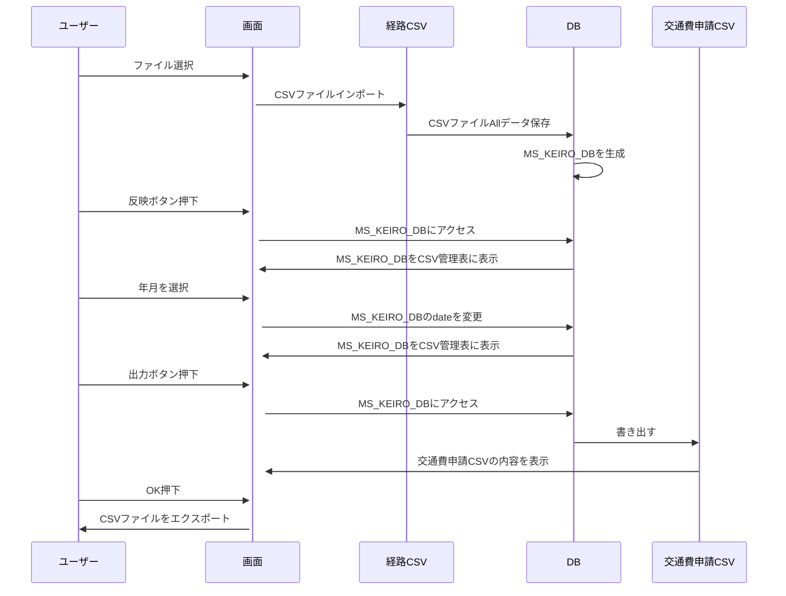

# 基本詳細設計書

1. プロジェクト名：CSVファイル自動生成
2. 作成日：YY/MM/DD
3. 作成者：橋本悠平

## システム概要

### 目的

経費（交通費）のCSVファイルを月単位で自動生成する

### 主な機能

1. 経路CSVファイルを経路DBに保存する
2. 選択された月のCSV管理表に経路DBの内容を一括表示する
3. 表示内容で問題なければ交通費申請CSVファイルを選択月で生成する

### 対象ユーザー

同一の経路で出勤することが多い従業員

### 開発環境

1. 言語：Java（version17）
2. フレームワーク：Spring boot
3. DB：SQLite

## 機能仕様

### 年月情報取得
アプリ起動時に処理対象の当月年度を自動的に取得し、後続の処理で利用する。
#### 入力：なし
App起動時に自動
#### 出力：あり
当月の年月情報（例：2025年4月など）

### ファイルの選択
ファイル選択ボタン押下時にファイル選択画面を表示し経路CSVファイルを選択する機能を追加する

#### 入力：あり
ローカルに保存されている経路CSVファイル（例：申請_2024年〇月経費申請.csv）
#### 出力：あり
選択されたファイル名を画面に表示する

### 反映ボタン押下
反映ボタンを押下時に経路CSVファイル内すべての内容をKEIRO_DBに登録する機能を追加

#### 入力：あり
選択された経路CSVファイルの内容
#### 出力：あり
CSV管理表にKEIRO_DBの内容を表示

### 月の選択
カレンダーウィジェットで選択した年月をCSV管理表に反映する

#### 入力：あり
選択された年月情報（例：2025年5月など）
#### 出力：あり
選択された年月（例：2025年5月など）
CSV管理表に年月情報を反映

### 生成欄のチェックボックス押下
生成欄のチェックボックスにユーザーがチェックを入れると該当日のCSV管理表にMS_KEIRO_DBの情報が反映する
チェックを外すと該当日のCSV管理表が未反映になる

#### 入力：あり
チェックボックスの操作（チェックの有無）
チェック有：該当日のデータを反映する
チェック無：該当日のデータを未反映にする
#### 出力：あり
チェック有：対象日のCSV管理表にMS_KEIRO_DBの情報を反映
チェック無：対象日のCSV管理表の内容が未反映として表示される

### 編集欄の編集ボタン押下
CSV管理表の編集欄に配置されている編集ボタンをユーザーが押下した際に該当日のMS_KEIRO_DB内容を編集できるモーダルを表示する

#### 入力：あり
編集ボタンがクリックされることで、該当する行のデータが選択され、その内容がモーダルに表示される。
#### 出力：あり
ユーザーが更新をクリックすると編集されたデータがCSV管理表に反映され、表示が更新される。

### 出力ボタン押下
出力ボタンをユーザーが押下時にCSV管理表の確認用モーダルが表示されOKかキャンセルを選択しOKの場合は交通費申請CSVを出力する

#### 入力：あり
ユーザーが出力ボタンを押下すると確認用モーダルが表示され出力内容確認メッセージを表示する（例：交通費申請CSVを出力します。よろしいですか？）

#### 出力：あり
ユーザーがOKを押下すると交通費申請CSVファイルが生成されローカル環境に保存される

# シーケンス図

## 機能詳細

## データ設計

```mermaid
erDiagram

    KEIRO_DB }o--|| MS_KEIRO_DB : "IDで関連付ける"

    KEIRO_DB {
        int id "ID"
        int detail_id "明細番号"
        int related_id "関連明細番号"
        date date "日付"
        int employee_id "従業員番号"
        string employee_name "従業員名"
        string payee_content "支払先・内容"
        string expense_category "経費科目"
        float converted_amount "円換算金額"
        float total_with_related "関連明細との合計"
        float total_tax_with_related "関連明細との消費税額合計"
        string memo "メモ"
        int inhouse_attendees "自社出席者"
        int inhouse_attendees_count "自社出席者人数"
        int external_attendees "他社出席者"
        int external_attendees_count "他社出席者人数"
        int total_attendees "出席者数"
        float amount_per_attendee "出席者あたりの円換算金額"
        string department_code "費用負担部門コード"
        string department_name "費用負担部門名"
        string project_name "プロジェクト名"
        string project_code "プロジェクトコード"
        string tax_category "税区分"
        string invoice_scheme "インボイス経過措置"
        float amount_inclusive_tax "金額（税込）"
        string currency "通貨"
        float exchange_rate "為替レート"
        float tax_amount "消費税額"
        string debit_account "借方勘定科目"
        string debit_sub_account "借方補助科目"
        string credit_account "貸方勘定科目"
        string credit_sub_account "貸方補助科目"
        string source_of_entry "明細取得元"
        bool journal_entry_created "仕訳作成済"
        int pre_approval_number "事前申請番号"
        string pre_approval_title "事前申請タイトル"
        int expense_request_number "経費申請番号"
        date request_date "申請日"
        string request_status "申請ステータス"
        string expense_request_title "経費申請タイトル"
        int created_by_id "作成者番号"
        string created_by_name "作成者名"
        datetime created_at "作成日時"
        int updated_by_id "更新者番号"
        string updated_by_name "更新者名"
        datetime updated_at "更新日時"
        string aggregate_title "集計タイトル"
    }

    MS_KEIRO_DB {
        int keiro_id "CSVファイルID"
        date date "日付"
        string payee "支払先・内容"
        string category "経費科目"
        float amount "金額"
        string memo "メモ"
        string memo "費用負担部名"
        string tax_category "費用負担部コード"
    }

```

## 画面設計

## システム構成

## テスト計画

