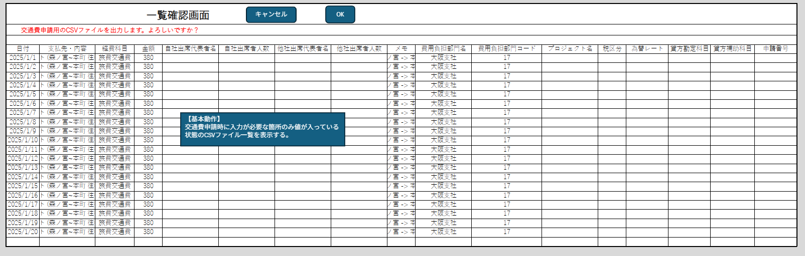

# 基本詳細設計書

1. プロジェクト名：CSVファイル自動生成
2. 作成日：YYYY/MM/DD
3. 作成者：橋本悠平

## システム概要

### 目的

CSV編集用のモーダルを表示する

### 主な機能

1. CSVファイル簡易作成ツール画面の編集ボタン押下時にCSV編集用モーダル画面を表示する。

2. 編集されたデータをWRK_KEIROに保存する。

### 対象ユーザー

同一の経路で出勤することが多い従業員

### 開発環境

1. 言語：Java（version17）
2. フレームワーク：Spring boot
3. DB：SQLite

## 画面設計

### 一覧確認画面

## 機能仕様

### データ表示

1. 当画面表示の際にWRK_KEIRO内すべてのデータを取得し表示する
2. CSVファイル生成確認メッセージを表示する

### キャンセルボタン押下

CSVファイル簡易作成ツール画面へ戻る

### OKボタン押下

CSVファイルの出力を行う

## 機能詳細

### データ表示：詳細

当画面表示の際にWRK_KEIROからデータすべてを取得し
表示する

- [ ] 入力なし：自動入力

- [ ] 出力あり：WRK_KEIROデータ

#### データ表示：実装方法

- コントローラークラス
  - データ取得処理を呼び出す
- サービスクラス
  - WRK_KEIRO内の全データ取得処理を行う

### キャンセルボタン押下：詳細

CSVファイル簡易作成ツール画面へ戻る

- [ ] 入力なし：CSVファイル簡易作成ツール画面に戻る

- [ ] 出力なし：CSVファイル簡易作成ツール画面に戻る

#### キャンセルボタン押下：実装方法

- コントローラークラス
  - CSVファイル簡易作成ツール画面へのリダイレクト処理

### OKボタン押下：詳細

CSVファイルの出力を行う

- [ ] 入力なし：

- [ ] 出力あり：WRK_KEIROのデータをCSVファイルとして出力

#### OKボタン押下：実装方法

- コントローラークラス
  - データ取得処理を呼び出す
  - CSVファイル書き出し処理を呼び出す
- サービスクラス
  - WRK_KEIROからデータ取得処理を行う
  - CSVファイルへの書き出し処理を行う
